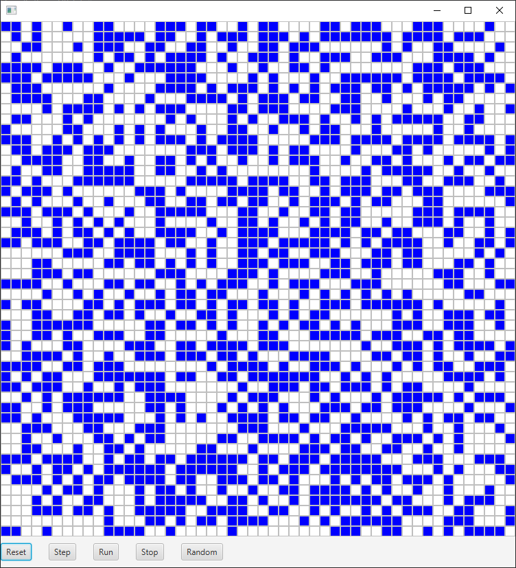

# GameOfLife
This is my implementation of Conway's Game of Life in kotlin, using JavaFX for graphic display.

## The rules of the game
Every cell interacts with its eight neighbours, which are the cells that are horizontally, vertically, or diagonally adjacent. At each step in time, the following transitions occur:
- Any live cell with two or three live neighbours survives.
- Any dead cell with three live neighbours becomes a live cell.
- All other live cells die in the next generation. Similarly, all other dead cells stay dead.

## How to build the project
To build the project you can either run ./gradlew build in gitBash or install IntelliJ, import the project and build it.

## Example
If your build was successful and if you run the project you should see something like this:
